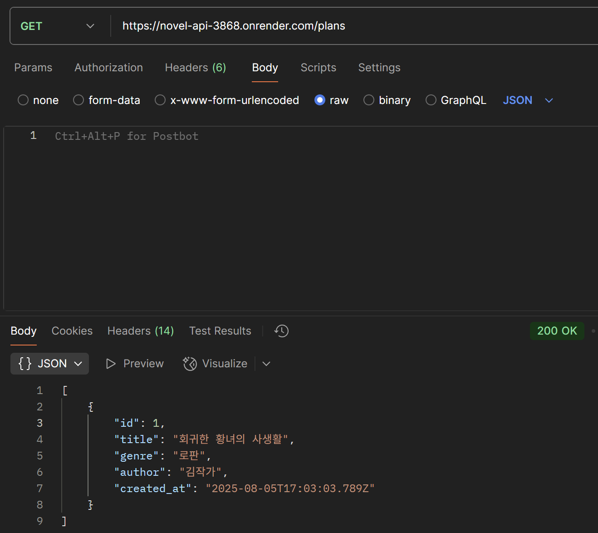
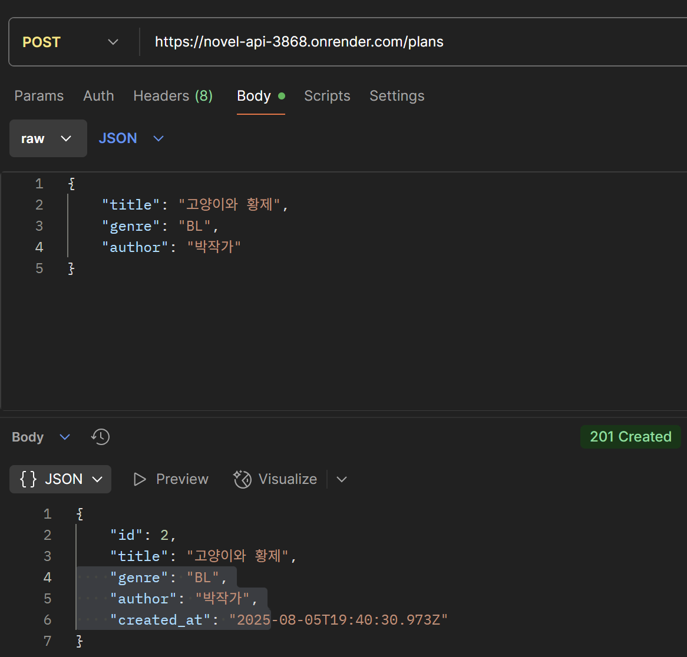
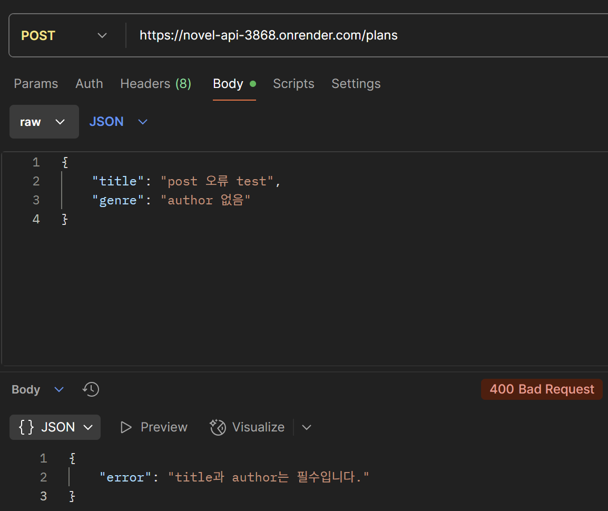
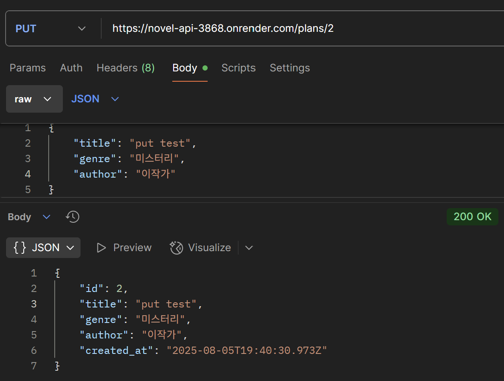
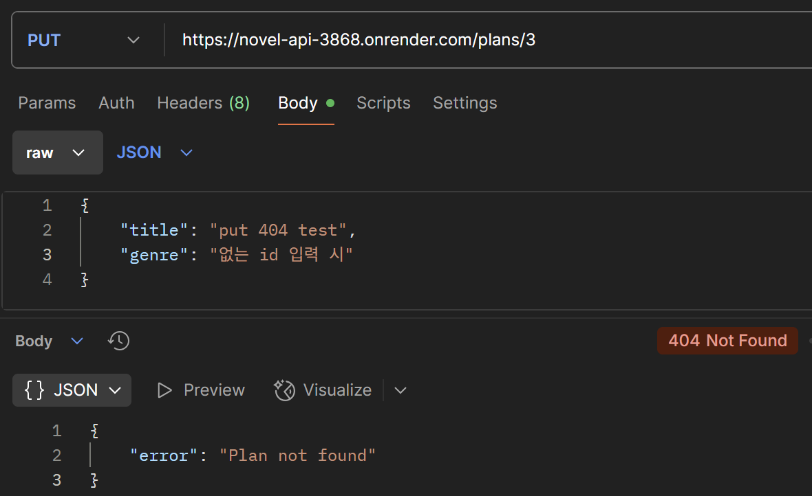
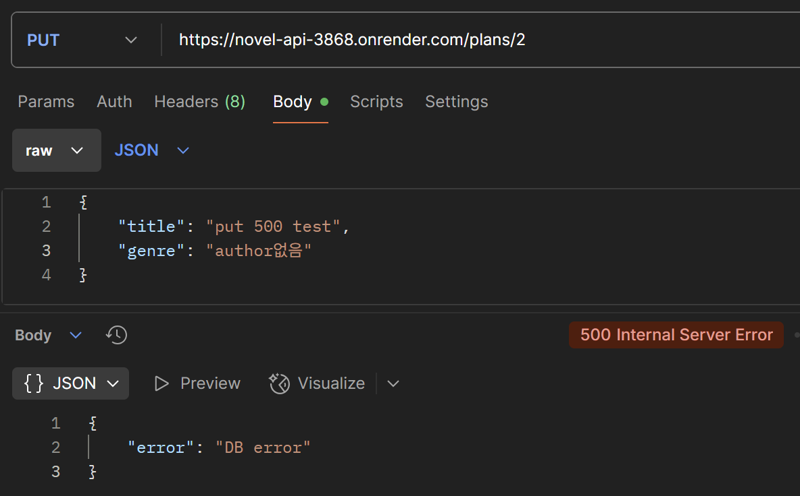
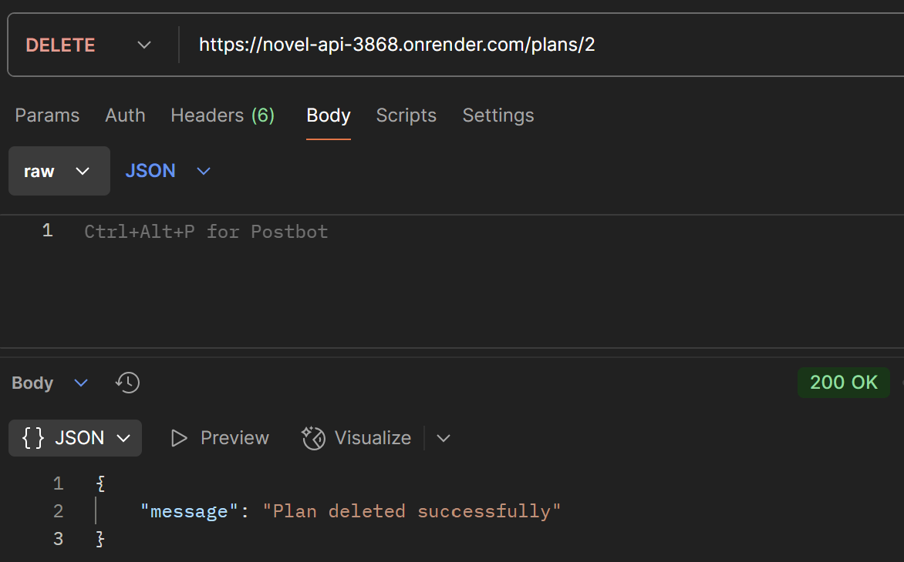
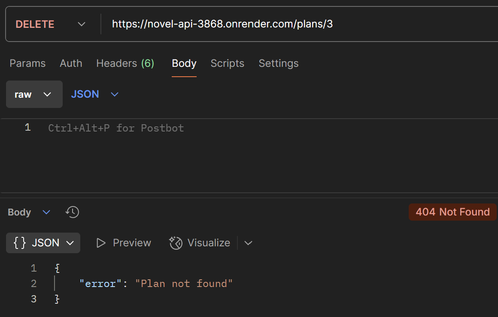

# 📚 웹소설 기획서 API 문서

Node.js + Express + PostgreSQL로 구현한 RESTful API입니다.  
웹소설 기획서를 추가/조회/수정/삭제할 수 있으며, Render를 통해 배포되었습니다.

---

## 🔗 배포 링크

- API 서버: https://novel-api-3868.onrender.com/plans

---

## 🛠 기술 스택

- Node.js
- Express.js
- PostgreSQL (Render 클라우드 DB)
- Jest _Supertest (테스트 프레임워크)
- Render (배포)
- Postman (API 테스트 도구)
- Git & GitHub

---

## 📌 주요 기능

| 메서드  |      경로       |       설명        |
|--------|----------------|-------------------|
| GET    | /plans         | 기획서 전체 조회    |
| POST   | /plans         | 기획서 추가        |
| PUT    | /plans/:id     | 특정 기획서 수정    |
| DELETE | /plans/:id     | 특정 기획서 삭제    |

---

## 📂 프로젝트 구조

```
NOVEL-API/
├── app.js # Express 앱 정의
├── index.js # 서버 실행
├── routes/ # 라우터 분리
├── controllers/ # 컨트롤러 함수
├── middlewares/ # 유효성 검사 등 미들웨어
├── utils/ # DB 연결 유틸
├── tests/ # Jest + Supertest 테스트 코드
├── .env # 환경 변수 파일(Git에 제외됨)
└── .gitignore #git에 올리면 안되는 것들
```

---

## 📄 환경변수 설정 (.env)
- `.env` 파일은 보안 문제로 Git에 포함되어 있지 않습니다.
- Render에 배포된 서버는 이미 다음 설정을 포함하고 있어 정상 작동합니다.

```env
DB_HOST=your-db-host
DB_USER=your-db-user
DB_PASSWORD=your-db-password
DB_NAME=your-db-name
DB_PORT=5432
```
---

## 🧪 기능 테스트(Postman으로 실제 테스트)

### ✅ GET /plans (브라우저에서 바로 확인 가능)
- https://novel-api-3868.onrender.com/plans

- **응답(200):**
<p align="center">

</p>

### ✅ POST /plans

새로운 기획서를 추가합니다.

- **요청/응답 성공(201):**
<p align="center">

</p>

- **오류 예시(400):**
<p align="center">

</p>

### ✅ PUT /plans/:id

기존 기획서를 수정합니다.

- **요청/응답 성공(200)**
<p align="center">

</p>

- **오류(404):**
<p align="center">

</p>

- **오류(500):**
<p align="center">

</p>

### ✅ DELETE /plans/:id

특정 기획서를 삭제합니다.

- **요청/응답 성공(200):**
<p align="center">

</p>

- **오류(404 - 없는 id 삭제):**
<p align="center">

</p>


## 🧪 테스트 코드 실행 방법

### 1. 프로젝트 루트에서 의존성 설치:
```bash
npm install
```

### 2. 서버 실행:
```bash
node index.js

또는

npm test
```
---
## 👩‍💻 개발자 정보
- **이름: 하서영**

- **GitHub: https://github.com/west096**

- **프로젝트 시작일: 2025년 7월 12일**

- **목적: 백엔드 API 실습**